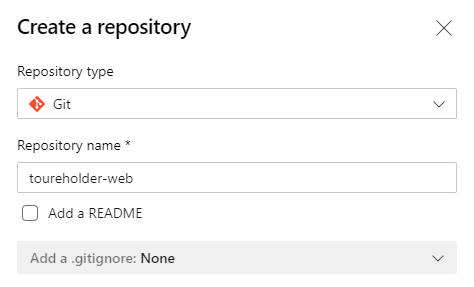
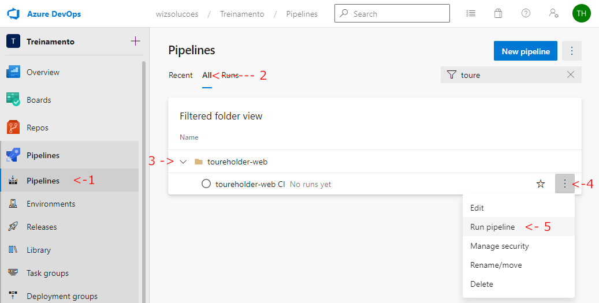

# Desafio TDD Angular


## Sobre
Este é um desafio de Test Driven Development com Angular.


## Getting started

```bash
# Instale as dependências
npm install

# Rodar a aplicação
ng serve

# Executar os testes
ng test

# Executar os testes e gerar relatório de cobertura de código
ng test --code-coverage
```

## O desafio

Seu desafio é implementar uma tela de cadastro com TDD e com os seguintes **requisitos**:

### Interface de usuário
A tela deve ter os seguintes elementos de UI:
- Um input para o nome
- Um input para o CPF
- Um input para o CEP
- Um botão para submeter o formulário

Segue uma sugestão de layout:


### Validações
O formulário deve ter as seguintes validações:
 - O nome deve ser uma string entre 2 a 30 caracteres
 - O CPF deve ser um CPF válido
 - O CEP deve ser um **CEP existente e validado pelo Webservice** https://viacep.com.br/

A validação pode ser simples e feita somente quando o botão de submeter for clicado **ou** à medida que o usuário digita. Fica ao seu critério.

### Serviço de usuário
Se o usuário clicar no botão de submeter e todos os campos estiverem válidos, a seguinte requisição `POST` deve ser feita para o endpoint `https://reqres.in/api/user` da [API REQ | RES](https://reqres.in/).

Request: `POST` `https://reqres.in/api/user`
```json
{
    "name": "string",
    "cpf": "string",
    "cep": "string"
}
```

Exemplo:
```json
{
    "name": "morpheus",
    "cpf": "73254157234",
    "cep": "70345080"
}
```

A resposta do servidor será:

Response: `201`

```json
{
    "name": "string",
    "cpf": "string",
    "cep": "string",
    "id": "string",
    "createdAt": "string"
}
```

Exemplo:
```json
{
    "name": "morpheus",
    "cpf": "73254157234",
    "cep": "70345080",
    "id": "901",
    "createdAt": "2020-07-13T11:37:03.172Z"
}
```

Não é necessário tratar a resposta do servidor na interface de usuário, mas o serviço de usuário deve ser testado. (Dica: por exemplo, você pode testar que o método `post` de um spy do `HTTPClient` foi chamado com o matcher `toHaveBeenCalled`. [Clique aqui para ver exemplos na documentação do Jasmine.](https://jasmine.github.io/2.5/introduction#section-Spies)

### Cobertura de testes
**IMPORTANTE:** Quando finalizar o desenvolvimento da funcionalidade, a cobertura de teste deve ser **100%**.

## Sobre o código existente
O projeto já tem o campo de nome implementado com validação e com testes. O código existente serve apenas como exemplo e um possível ponto de partida. Você pode remover ou modificá-lo à vontade desde que os requisitos da funcionalidade sejam atendidos.

---

## O desafio também é de DevOps!

Os desafio deve ser desenvolvido dentro deste Projeto de Treinamento no **Azure Devpos da Wiz**: 
https://dev.azure.com/wizsolucoes/Treinamento. **Para cumprir os requisitos de DevOps, siga este roteiro para execução:**

### Passo 1: Acesse o projeto de Treinamento
https://dev.azure.com/wizsolucoes/Treinamento


### Passo 2: Crie um *PBI* para fazer o desafio

Acesse **Boards > Workitems > New Workitems > Product Backlog Item**

Crie um Product Backlog Item no seguinte formato: `Treinamento :: <seuloginwiz> :: Implementar TDD-Frontend`.

[Veja um exemplo](https://dev.azure.com/wizsolucoes/Treinamento/_workitems/edit/68481)


### Passo 3: Crie um novo repositório no Azure DevOps

Acesse **Project settings > Repositories > Create** 

Crie um novo repositório (sem README e sem .gitignore) no formato `seuloginwiz-web` (Ex. toureholder-web) 

[Veja um exemplo](https://dev.azure.com/wizsolucoes/Treinamento/_git/toureholder-web)




### Passo 4: Suba esta aplicação starter para seu repositório no Azure DevOps

Neste passo você vai clonar este repositório e trocar o remoto `origin` do Github para o Azure DevOps.

```bash
## Clone este repositório
git clone git@github.com:wizsolucoes/frontend-tdd-challenge.git

## Entre na pasta deste projeto
cd frontend-tdd-challenge

## Troque o remoto origin para seu <seunome>-web repositório:
git remote remove origin
git remote add origin git@ssh.dev.azure.com:v3/wizsolucoes/Treinamento/<seunome>-web ## Use o nome do seu repositório

## Dê um push para criar a branch no repositório no Azure DevOps
git push -u origin --all
```

### Passo 5: Execute o Pipeline do seu repositório
Este projeto *starter* já tem um arquivo `azure-pipelines.yml`. Com este código no seu repositório, você deve rodar o Pipeline do projeto pela primeira vez para ativá-lo para seu repositório.

Acesse **Pipelines > All** 



### Passo 6: Arrocha!
Com o repositório criado e configurado você pode fazer o desenvolvimento da funcionalidade do desafio. Atente-se para o fluxo DevOps que foi ensinado no treinamento:

- Criar `feature/*` branch para fazer o desenvolvimento da funcionalidade
- As mensagens de commit devem seguir a convenção de [Conventional commits](https://www.conventionalcommits.org/en/v1.0.0/) que é o padrão para todos os projetos da Wiz. Este projeto já tem commit lint configurado com [husky](https://github.com/typicode/husky) para te ajudar. [Consulte a convenção Angular se tiver dúvidas sobre o tipo correto para seu commit.](https://github.com/angular/angular/blob/22b96b9/CONTRIBUTING.md#type)
- Criar `release/*` quando tiver "finalizado" o desenvolvimento. (Lembre que a branch `release/*` não aceita *pushs* e aceita somente PRs da sua branch `feature/*`)
- Criar Pull request (PR) da branch `release/*` para a branch `master`
- Solicitar revisão do PR
- Completar seu PR
